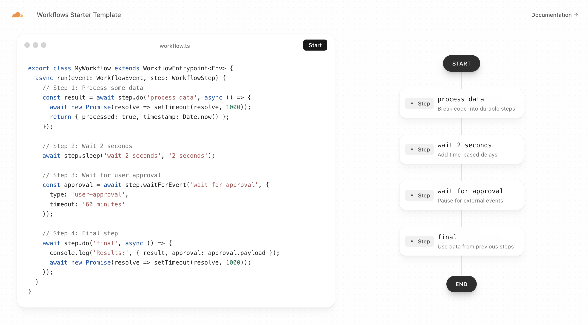

# Cloudflare Workflows Starter Template

[](https://deploy.workers.cloudflare.com/?url=https://github.com/cloudflare/templates/tree/main/workflows-starter-template)

<!-- dash-content-start -->

A real-time, interactive demonstration of [Cloudflare Workflows](https://developers.cloudflare.com/workflows) with live updates via WebSockets and Durable Objects. This template showcases durable multi-step workflows with time-based delays, event-driven pauses, and real-time status visualization.

<!-- dash-content-end -->



## Getting Started

### Installation

```bash
npm install
```

### Development

```bash
npm run dev
```

Visit `http://localhost:5173` to see the interactive demo.

### Deployment

```bash
npm run deploy
```

## File Structure

```
workflows-starter-template1/
├── assets/
│   └── template-screenshot.png   # Screenshot used in README
├── src/
│   ├── components/
│   │   ├── BackgroundDots.tsx     # Animated background dots component
│   │   ├── CodeDisplay.tsx        # Code/JSON display component
│   │   └── WorkflowDiagram.tsx    # Workflow step diagram component
│   ├── hooks/
│   │   └── useWorkflowWebSocket.ts # WebSocket hook for workflow updates
│   ├── App.tsx                    # Root React application component
│   ├── index.css                  # Global styles
│   ├── main.tsx                   # React entry point
│   ├── types.ts                   # Shared TypeScript types
│   └── vite-env.d.ts              # Vite environment type declarations
├── test/
│   ├── cloudflare-test.d.ts       # Type declarations for Cloudflare test env
│   └── workflow.test.ts           # Workflow unit tests
├── worker/
│   ├── durable-object.ts          # Durable Object for WebSocket connections
│   ├── index.ts                   # Worker entry point / request router
│   └── workflow.ts                # Cloudflare Workflow definition
├── .gitignore
├── eslint.config.js               # ESLint configuration
├── index.html                     # HTML entry point for the frontend
├── package.json                   # Project dependencies and scripts
├── package-lock.json
├── postcss.config.js              # PostCSS / Tailwind build config
├── tailwind.config.js             # Tailwind CSS configuration
├── tsconfig.json                  # Root TypeScript configuration
├── tsconfig.app.json              # TypeScript config for the React app
├── tsconfig.node.json             # TypeScript config for Node/Vite tools
├── tsconfig.worker.json           # TypeScript config for the Worker
├── vite.config.ts                 # Vite bundler configuration
├── vitest.config.ts               # Vitest test runner configuration
├── worker-configuration.d.ts      # Auto-generated Worker env type bindings
└── wrangler.jsonc                 # Cloudflare Wrangler deployment config
```

## Learn More

- [Cloudflare Workflows Documentation](https://developers.cloudflare.com/workflows)
- [Durable Objects Documentation](https://developers.cloudflare.com/durable-objects)
- [Workers Documentation](https://developers.cloudflare.com/workers)
